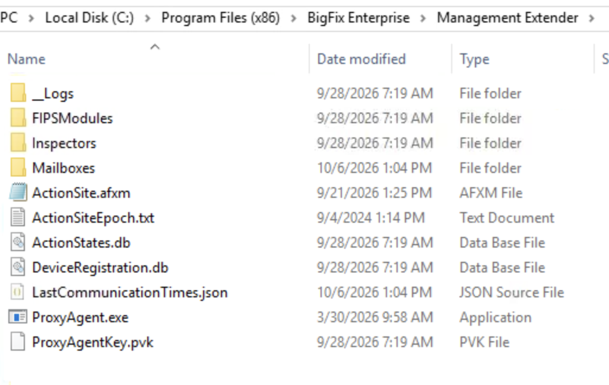
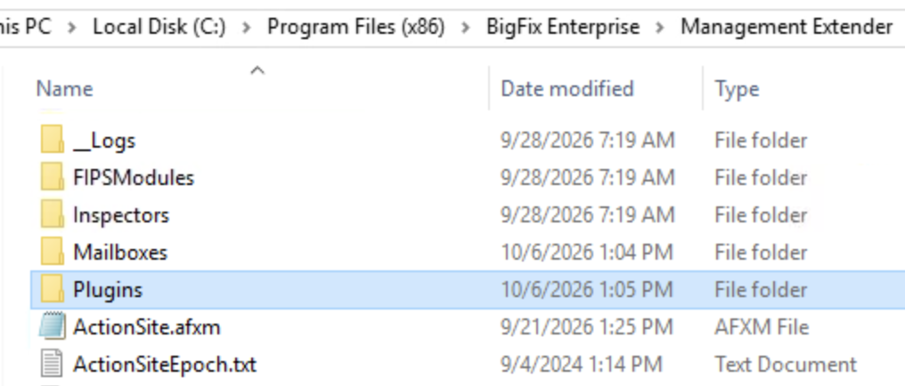
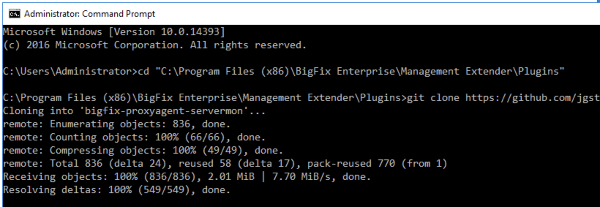
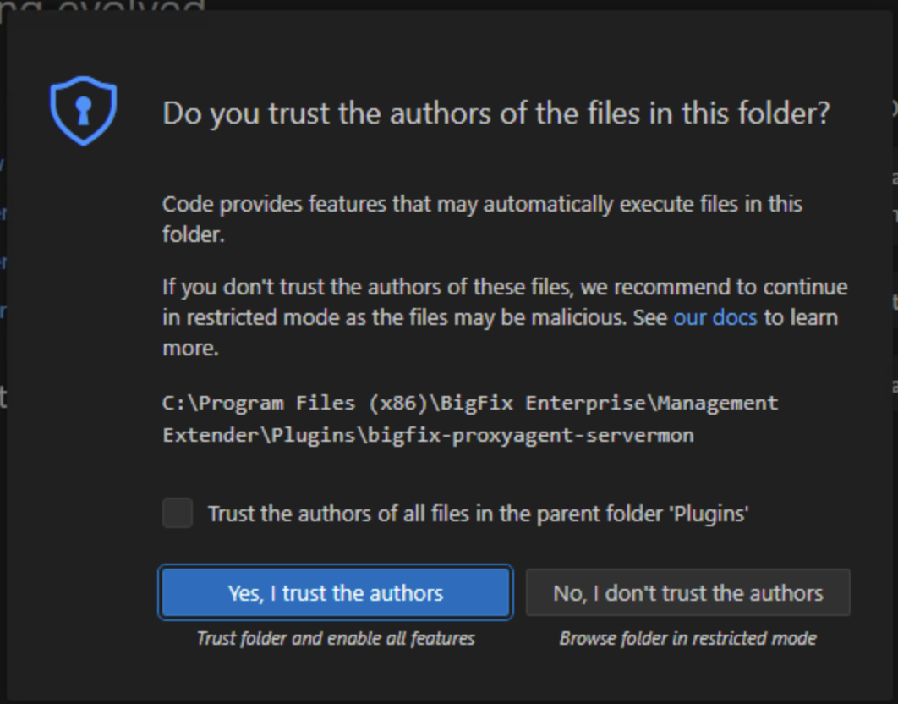
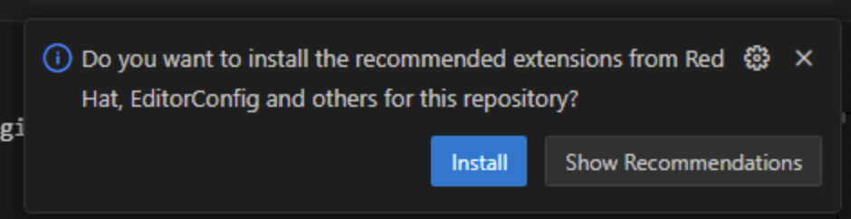
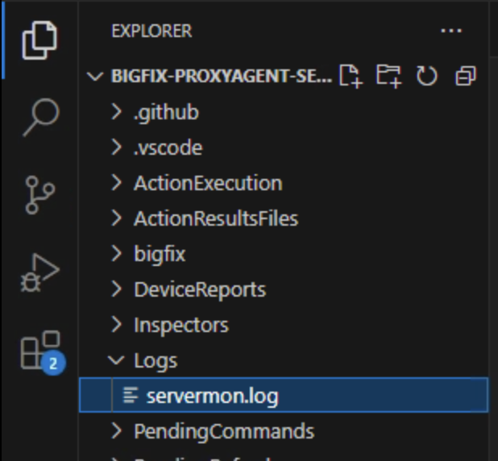

[Lab index](README.md) | [Next: Part 2 - Find the devices in the console (~5 min)](02-find-devices.md)

# Part 1 - Install the plugin (~10 min)

## 1.1 Install

On the Management Extender host:

1. Open a **Command Prompt as administrator** - the plugin goes under `Program Files`.

2. Stop the Proxy Agent service:

   ```bat
   net stop BESProxyAgent
   ```

3. Look in the Management Extender folder. A new install has no `Plugins` folder yet:

   

   If it is missing, create it:

   ```bat
   mkdir "C:\Program Files (x86)\BigFix Enterprise\Management Extender\Plugins"
   ```

   

4. Clone the plugin into it:

   ```bat
   cd "C:\Program Files (x86)\BigFix Enterprise\Management Extender\Plugins"
   git clone https://github.com/jgstew/bigfix-proxyagent-servermon.git
   ```

   

5. Start the service again:

   ```bat
   net start BESProxyAgent
   ```

## 1.2 Verify

Get in the habit of testing the plugin directly - it answers in seconds, while the console
answers in minutes. From the plugin folder:

```bat
py -3 plugin\servermon.py --config servermon.toml --validate
```

That parses [`servermon.toml`](../../servermon.toml) and reports any configuration error. Then
actually check every URL once:

```bat
py -3 plugin\servermon.py --config servermon.toml --check
```

One line per URL, and a non-zero exit code if any check failed. Neither command needs the
Proxy Agent to be running.

## 1.3 Open the plugin in VS Code

Open the cloned folder in VS Code - either **File > Open Folder** and pick
`bigfix-proxyagent-servermon`, or from the plugin folder's parent:

```bat
code bigfix-proxyagent-servermon
```

When VS Code asks **Do you trust the authors of the files in this folder?**, choose
**Yes, I trust the authors**. In Restricted Mode, VS Code disables features such as
the integrated terminal and extensions for that folder.



If VS Code then offers to install the **recommended extensions** for this repository, choose
**Install**. The list is in [`.vscode/extensions.json`](../../.vscode/extensions.json).



Keep this window open for the rest of the lab: you will watch
[`servermon.toml`](../../servermon.toml) change in it as you work from the console, and
run commands in its integrated terminal (**Terminal > New Terminal**), which opens in the
plugin folder. You will not edit any files until Part 4. The folder is under
`Program Files`, so if VS Code cannot save a file then, reopen VS Code as administrator.

Once the plugin has run, its log is at `Logs\servermon.log` in the Explorer. It is the
first place to look when something does not work:



If the plugin does not seem to run, see
[Troubleshooting -> Check settings.json](troubleshooting.md#check-settingsjson).

---

[Lab index](README.md) | [Next: Part 2 - Find the devices in the console (~5 min)](02-find-devices.md)
