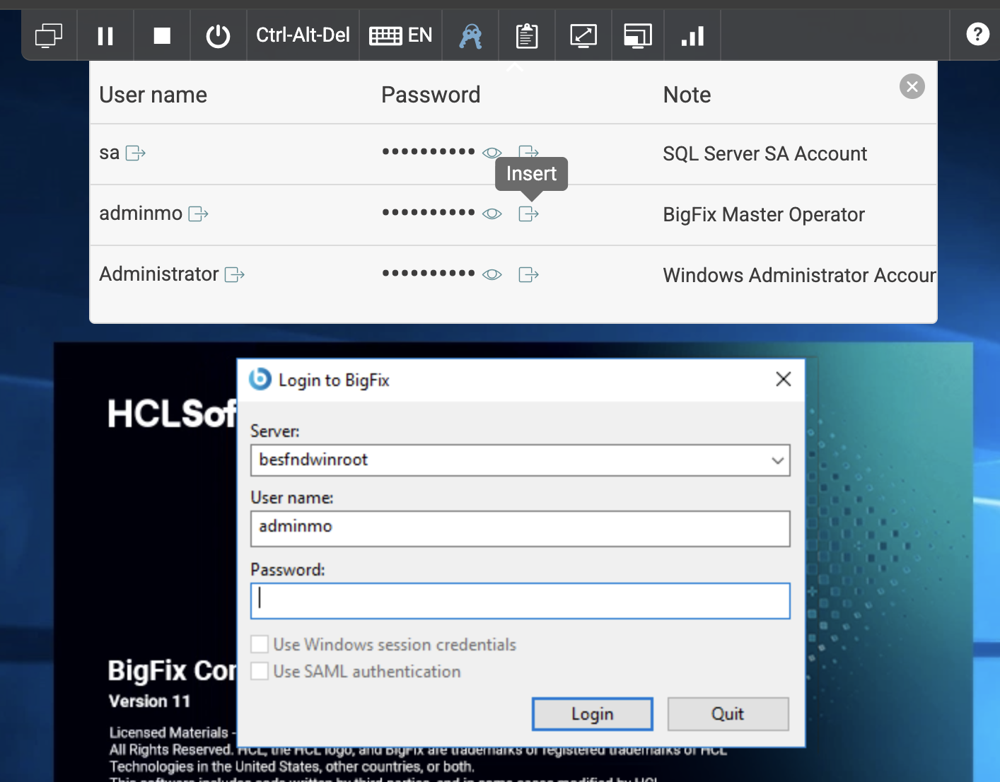
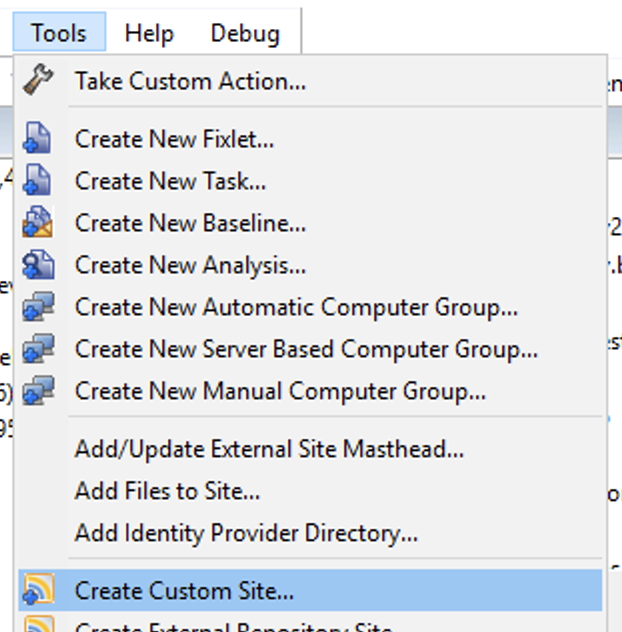
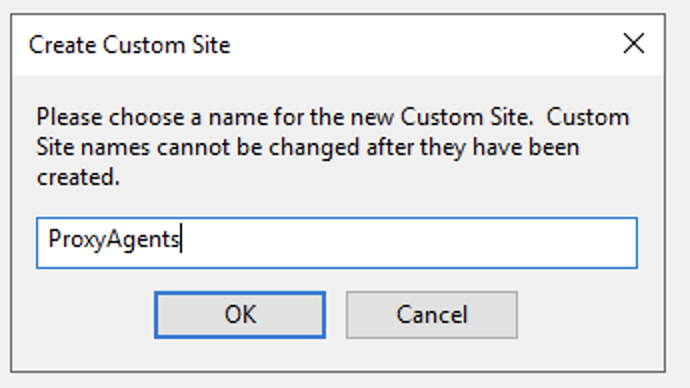
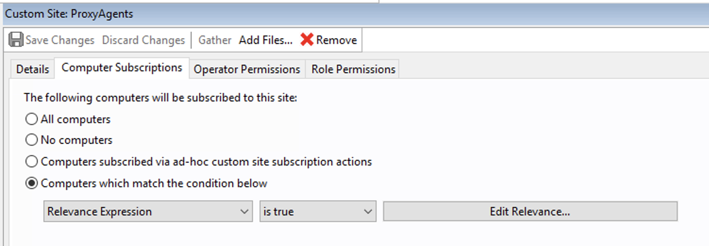
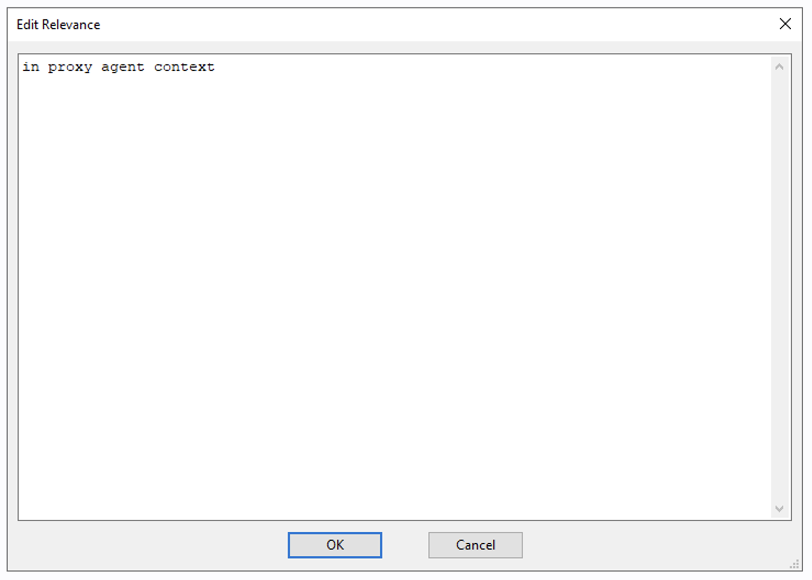
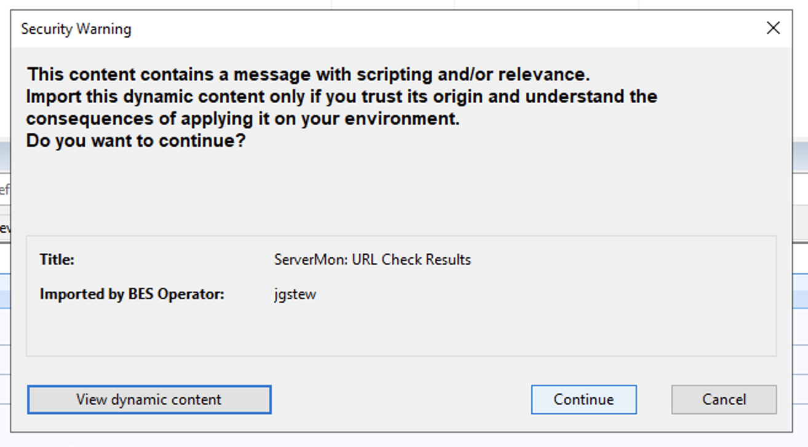
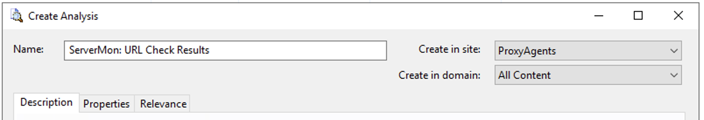
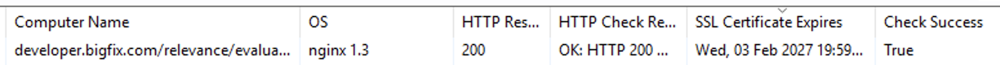

[Previous: Part 1 - Install the plugin (~10 min)](01-install.md) | [Lab index](README.md) | [Next: Part 3 - Manage URLs from the console (~25 min)](03-console.md)

# Part 2 - Find the devices in the console (~5 min)

## 2.1 Log in to the BigFix console

Open the **BigFix Console** and log in with the master operator account for your lab. In
the lab environment, the credentials panel can type the user name and password in for you
with **Insert**:



## 2.2 Find the devices in the BigFix console

Within one heartbeat, the URLs from the shipped [`servermon.toml`](../../servermon.toml) appear in **Computers**
as ordinary-looking devices:

- **Device Type** is `Web Server`.
- The **OS** column shows the web server's `Server` header (for example `nginx/1.25.3`).
- The device name is the URL with the scheme removed - `https://example.com` becomes
  `example.com`.

## 2.3 Create a custom site

Put all of this lab's content - the analysis now and the tasks later - in a custom site of
its own, subscribed only by the devices this plugin reports.

1. In the console, choose **Tools > Create Custom Site...**.

   

2. Name the site `ProxyAgents` and click **OK**. Custom site names cannot be changed
   later.

   

3. On the **Computer Subscriptions** tab, choose **Computers which match the condition
   below**, set the condition to **Relevance Expression** **is true**, and click
   **Edit Relevance...**.

   

4. Enter the relevance below, click **OK**, then **Save Changes** and enter your operator
   password if asked.

   ```
   in proxy agent context
   ```

   

That relevance subscribes every device a Proxy Agent reports, and no ordinary computers.

## 2.4 Import the analysis

Import [`bigfix/content/analysis-servermon.bes`](../content/analysis-servermon.bes) into the
console. It exposes everything the plugin reports as properties: response code, check
result, response time, TLS version, certificate expiry and more.

On the plugin host the file is in this folder:

```
C:\Program Files (x86)\BigFix Enterprise\Management Extender\Plugins\bigfix-proxyagent-servermon\bigfix\content
```

1. The console warns that the content contains relevance. Click **Continue** - you can
   click **View dynamic content** first to see what it is.

   

2. In the **Create Analysis** window, set **Create in site** to `ProxyAgents`, then save
   it.

   

> **Checkpoint 1** - you have a device named `example.com` whose *HTTP Response Code* is
> `200` and whose *HTTP Check Result* starts with `OK:`. For example (your device names
> will differ):
>
> 

**What to notice**

- One `[[urls]]` entry in [`servermon.toml`](../../servermon.toml) equals exactly one device in BigFix.
- Device identity is the **full URL**, so `http://example.com` and `https://example.com`
  are two separate devices with separate history.
- **Last Report Time** is the last time the URL actually *answered*. A URL that stops
  responding goes stale and eventually greys out like a dead client, while its other
  properties keep updating. That is deliberate - it makes a dead site look dead.

---

[Previous: Part 1 - Install the plugin (~10 min)](01-install.md) | [Lab index](README.md) | [Next: Part 3 - Manage URLs from the console (~25 min)](03-console.md)
