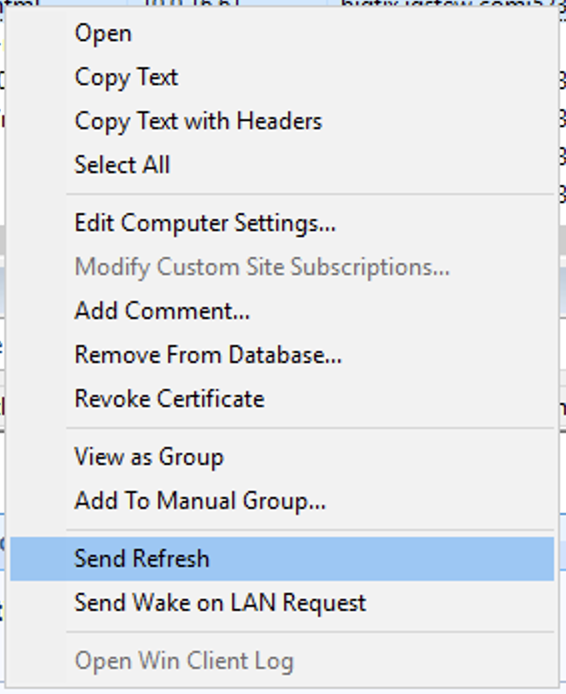

[Previous: Part 2 - Find the devices in the console (~5 min)](02-find-devices.md) | [Lab index](README.md) | [Next: Part 4 - Edit servermon.toml directly (advanced, ~10 min)](04-edit-toml.md)

# Part 3 - Manage URLs from the console (~25 min)

Every change in this lab is a BigFix action targeted at a servermon device - adding a URL,
changing a match string, changing a cadence, removing a URL. This is how you would run
the plugin day to day, especially when the plugin host belongs to another team.

**Do not edit [`servermon.toml`](../../servermon.toml) yet.** Keep it open in VS Code and
watch it: each action you run changes the file for you, and VS Code reloads it as it
changes. Editing it by hand comes later, in Part 4.

## 3.1 Import the tasks

Import all four tasks from [bigfix/content/](../content/) the same way as the analysis:
click **Continue** at the security warning, and set **Create in site** to `ProxyAgents`
for each one.


| Task | Actionscript it runs |
|---|---|
| [`ServerMon_ProxyAgent_add_url.bes`](../content/ServerMon_ProxyAgent_add_url.bes) | `push link <url>` |
| [`ServerMon_ProxyAgent_set_url_option.bes`](../content/ServerMon_ProxyAgent_set_url_option.bes) | `set <field> <value>` |
| [`ServerMon_ProxyAgent_set_refresh_interval.bes`](../content/ServerMon_ProxyAgent_set_refresh_interval.bes) | `set refresh interval <minutes>` |
| [`ServerMon_ProxyAgent_Delete_Virtual_Device.bes`](../content/ServerMon_ProxyAgent_Delete_Virtual_Device.bes) | `delete device` |

Look at their relevance: `in proxy agent context` and `exists servermon version`. That
pair keeps these tasks relevant only on devices this plugin reports, so they can never be
run against a real computer by accident.

When you are done, the `ProxyAgents` site holds four tasks and one analysis:


## 3.2 Why is the add-URL command called `push link`?

Because a Proxy Agent plugin **cannot invent new actionscript command names**. The Proxy
Agent only forwards commands listed in `ProxyPluginCommands.json` (published on the BES
Support site) - a central whitelist that your plugin cannot add itself to. In practice, a
command listed there for *any* plugin gets delivered, so servermon borrows an existing
whitelisted name, `push link`, and treats its argument as the URL to add.

Worth remembering when you write your own plugin: implement commands BigFix already
knows, or the agent will never hand them to you.

## 3.3 Add URLs from the console

Make a copy of the **add url** task and change its actionscript to a URL of your choosing:

```
push link https://<your-lab-site>/
```

Target it at **any** servermon device. The target genuinely does not matter here - the URL
comes from the argument, and there is no "plugin-level" device to aim at.

Run it, and watch the action status go to **Completed**. In VS Code, a new `[[urls]]`
entry appears at the end of [`servermon.toml`](../../servermon.toml).

Do it again for a second page on the same site, for example
`https://<your-lab-site>/some-page`.

The new devices appear on the next refresh. To get one now, right-click any servermon
device in the console and choose **Send Refresh** - you will use that a lot in this lab.



**What to notice**

- Nothing was restarted. The plugin re-reads [`servermon.toml`](../../servermon.toml) every
  time it runs, and a URL that has never been checked is reported on the next refresh.
- One `[[urls]]` entry is one device, so adding the same URL twice is refused: the action
  comes back **Error**.

## 3.4 Fix a failing check from the console

This is the one to slow down for. First, break the second URL on purpose. Copy the
**set url option** task, target the device for that second page, and set:

```
set match Welcome back
```

Use text that is deliberately **not** on the page. Run it, watch `match = "Welcome back"`
appear under that entry in VS Code, then **Send Refresh** on the device.

> **Checkpoint 2** - the device shows *Check Success* `False`, *Match Found* `False`, and an
> *HTTP Check Result* starting with `FAILED:`.

Now repair it the same way, with text that really is on the page:

```
set match <the text that is actually on the page>
```

Run it, then **Send Refresh** on that device. *Check Success* flips to `True`.

You just fixed a monitoring check without logging into the server that runs the monitor.

**What to notice**

- `match` and `no_match` are case-insensitive **regular expressions**, not plain text.
  They are searched against the response headers and the first 1 MiB of the body. Plain
  words work fine, but `.` `?` `*` `+` `(` `)` `[` `]` are regex metacharacters - escape
  them with a backslash if you mean them literally.
- Two different failure prefixes, and the difference matters when you are on the phone
  with a site owner:
  - `FAILED:` - the server answered, but the check rules said no (bad status code, the
    `match` was missing, or a `no_match` string was present).
  - `ERROR:` - no HTTP response at all: DNS, TCP, TLS or timeout. These report
    *HTTP Response Code* `0`.
- `no_match` is the one people underestimate: it fails a check that returned HTTP 200 but
  served a page saying "Could not connect to the database". Up is not the same as working.

Variations worth trying:

- `set match` with **no value** clears the match entirely, reverting to the default.
- `set verify_tls false` is how you monitor an internal site with a self-signed
  certificate - but note the side effect: with TLS verification off, the plugin stops
  reporting *SSL Certificate Expires* for that URL.
- `set timeout_seconds 10`, `set no_match <bad text>`, `set measure_network_hops true`.

An unknown field or a bad value is refused: the action comes back **Error** and nothing is
written.

## 3.5 Change how often a URL is checked

Target one device with the **set refresh interval** task:

```
set refresh interval 5
```

Leave another device at a long interval (say 360). Now compare these three properties
across the two devices:

| Property | Fast device | Slow device |
|---|---|---|
| *Refresh Interval (Minutes)* | 5 | 360 |
| *Last Check Time* | recent | stale |
| *Last Report Time* | recent | recent |

The slow device is still reporting on every heartbeat - but the plugin is **replaying its
cached report** instead of hitting the URL again. That is why its last *check* time is old
while the device still looks alive. The rule: a refresh must always be answered with a
report, or pending actions against that device would hang forever.

Set the Proxy Agent heartbeat to the fastest cadence you need anywhere, then use
`refresh interval` to make individual URLs cheaper.

## 3.6 Retire a device

Target one of the URLs you added with the **Delete Virtual Device** task:

```
delete device
```

Watch what happens: the action reports **Completed**, the device is reported **one more
time** on the next refresh, and only then does its `[[urls]]` entry disappear from
[`servermon.toml`](../../servermon.toml) in VS Code. That deferral is required by the
protocol - a refresh must always produce a report.

Note what this does *not* do: it stops monitoring the URL, but it does not remove the
computer from the BigFix console. The device goes silent and expires after
`DeviceReportExpirationIntervalHours` (168 by default), or you delete the computer in the
console for immediate removal.

## 3.7 Read the action status

Throughout this lab, the action status is the plugin's own answer, not just "the action
ran":

| Status | Meaning |
|---|---|
| `Completed` | the plugin did it |
| `Failed` | the external system refused - for an action-driven `refresh`, the URL check itself failed |
| `Error` | the plugin could not even try: unknown field, bad value, duplicate URL, unknown device |

> **Checkpoint 3** - look at [`servermon.toml`](../../servermon.toml) in VS Code. Compared
> with the original it has new entries, a new match, a new interval and one entry gone -
> and you never edited it. Notice the comments and formatting are still intact.

---

[Previous: Part 2 - Find the devices in the console (~5 min)](02-find-devices.md) | [Lab index](README.md) | [Next: Part 4 - Edit servermon.toml directly (advanced, ~10 min)](04-edit-toml.md)
