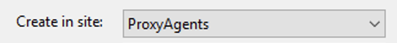
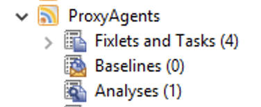
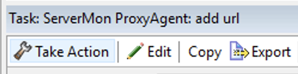
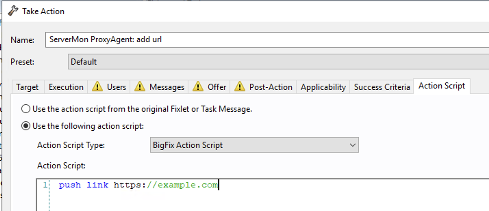

[Previous: Part 2 - Find the devices in the console (~5 min)](02-find-devices.md) | [Lab index](README.md) | [Next: Part 4 - Edit servermon.toml directly (advanced, ~10 min)](04-edit-toml.md)

# Part 3 - Manage URLs from the console (~25 min)

Every change in this lab is a BigFix action targeted at a servermon device - adding a URL,
changing a match string, changing a cadence, removing a URL. This is how you would run
the plugin day to day, especially when the plugin host belongs to another team.

**Do not edit [`servermon.toml`](../../servermon.toml) yet.** Keep it open in VS Code and
watch it: each action you run changes the file for you, and VS Code reloads it as it
changes. Editing it by hand comes later, in Part 4.

## 3.1 Import the tasks

Import all four tasks from [bigfix/content/](../content/) the same way as the analysis.
On the plugin host they are in this folder:

```
C:\Program Files (x86)\BigFix Enterprise\Management Extender\Plugins\bigfix-proxyagent-servermon\bigfix\content
```

For each one, click **Continue** at the security warning, and set **Create in site** to
`ProxyAgents`.



| Task | Actionscript it runs |
|---|---|
| [`ServerMon_ProxyAgent_add_url.bes`](../content/ServerMon_ProxyAgent_add_url.bes) | `push link <url>` |
| [`ServerMon_ProxyAgent_set_url_option.bes`](../content/ServerMon_ProxyAgent_set_url_option.bes) | `set <field> <value>` |
| [`ServerMon_ProxyAgent_set_refresh_interval.bes`](../content/ServerMon_ProxyAgent_set_refresh_interval.bes) | `set refresh interval <minutes>` |
| [`ServerMon_ProxyAgent_Delete_Virtual_Device.bes`](../content/ServerMon_ProxyAgent_Delete_Virtual_Device.bes) | `delete device` |

Look at their relevance: `in proxy agent context` and `exists servermon version`. That
pair keeps these tasks relevant only on devices this plugin reports, so they can never be
run against a real computer by accident.

When you are done, the `ProxyAgents` site holds four tasks and one analysis:



## 3.2 Why is the add-URL command called `push link`?

Because a Proxy Agent plugin **cannot invent new actionscript command names**. The Proxy
Agent only forwards commands listed in `ProxyPluginCommands.json` (published on the BES
Support site) - a central whitelist that your plugin cannot add itself to. In practice, a
command listed there for *any* plugin gets delivered, so servermon borrows an existing
whitelisted name, `push link`, and treats its argument as the URL to add.

Worth remembering when you write your own plugin: implement commands BigFix already
knows, or the agent will never hand them to you.

## 3.3 Add URLs from the console

Every task in this lab runs the same way: take action, pick a target, then edit the
actionscript for this one action. The task itself is never changed.

1. Open the **ServerMon ProxyAgent: add url** task in the `ProxyAgents` site and click
   **Take Action**.

   

2. On the **Target** tab, select **any** servermon device. The target genuinely does not
   matter for this task - the URL comes from the actionscript, and there is no
   "plugin-level" device to aim at.

3. On the **Action Script** tab, choose **Use the following action script** and change
   the URL to:

   ```
   push link https://developer.bigfix.com/
   ```

   

4. Click **OK** to run it.

Watch the action status go to **Completed**. In VS Code, a new `[[urls]]`
entry appears at the end of [`servermon.toml`](../../servermon.toml).

Do it again for a second page on the same site:

```
push link https://developer.bigfix.com/relevance/
```

Use real, reachable URLs like these, not made-up ones. The plugin host must be able to
reach the URL: a name that does not resolve can only ever report `ERROR:`, and the next
step needs a site that answers.

You don't have to wait for the next heartbeat. When an action completes, the Proxy Agent
refreshes the device you targeted, and the plugin uses that refresh to check and report
any URL it has never checked. The new device appears in **Computers** shortly after the
action shows **Completed**.

**What to notice**

- Nothing was restarted. The plugin re-reads [`servermon.toml`](../../servermon.toml) every
  time it runs, and a URL that has never been checked is reported on the next refresh of
  any servermon device.
- One `[[urls]]` entry is one device, so adding the same URL twice is refused: the action
  comes back **Error**.

## 3.4 Fix a failing check from the console

This is the one to slow down for. First, break the second URL on purpose. Take action
on the **set url option** task, target the `developer.bigfix.com/relevance/` device, and on the
**Action Script** tab set:

```
set match Welcome back
```

Use text that is deliberately **not** on the page. Run it and watch `match = "Welcome back"`
appear under that entry in VS Code. Changing an option makes the plugin re-check that URL
on its next refresh - the one the Proxy Agent sends as the action completes - so the new
result arrives with the action, without waiting for the URL's check interval.

> **Checkpoint 2** - the device shows *Check Success* `False`, *Match Found* `False`, and an
> *HTTP Check Result* starting with `FAILED:`.

Now repair it the same way - take action on **set url option** again - with text that
really is on the page:

```
set match Relevance Language
```

Run it. Once the action completes, *Check Success* flips to `True`.

For contrast, add a URL whose name does not resolve, such as
`push link https://servermon-lab-test.invalid/`. It reports `ERROR:` and *HTTP Response
Code* `0` - no `match` can fix that, because no server ever answered. Retire it in 3.6.

You just fixed a monitoring check without logging into the server that runs the monitor.

**What to notice**

- `match` and `no_match` are case-insensitive **regular expressions**, not plain text.
  They are searched against the response headers and the first 1 MiB of the body. Plain
  words work fine, but `.` `?` `*` `+` `(` `)` `[` `]` are regex metacharacters - escape
  them with a backslash if you mean them literally.
- Two different failure prefixes, and the difference matters when you are on the phone
  with a site owner:
  - `FAILED:` - the server answered, but the check rules said no (bad status code, the
    `match` was missing, or a `no_match` string was present).
  - `ERROR:` - no HTTP response at all: DNS, TCP, TLS or timeout. These report
    *HTTP Response Code* `0`.
- `no_match` is the one people underestimate: it fails a check that returned HTTP 200 but
  served a page saying "Could not connect to the database". Up is not the same as working.

Variations worth trying:

- `set match` with **no value** clears the match entirely, reverting to the default.
- `set verify_tls false` is how you monitor an internal site with a self-signed
  certificate - but note the side effect: with TLS verification off, the plugin stops
  reporting *SSL Certificate Expires* for that URL.
- `set timeout_seconds 10`, `set no_match <bad text>`, `set measure_network_hops true`.

An unknown field or a bad value is refused: the action comes back **Error** and nothing is
written.

## 3.5 Change how often a URL is checked

Take action on the **set refresh interval** task, target one device, and on the
**Action Script** tab set:

```
set refresh interval 5
```

Leave another device at a long interval (say 360). Now compare these three properties
across the two devices:

| Property | Fast device | Slow device |
|---|---|---|
| *Refresh Interval (Minutes)* | 5 | 360 |
| *Last Check Time* | recent | stale |
| *Last Report Time* | recent | recent |

The slow device is still reporting on every heartbeat - but the plugin is **replaying its
cached report** instead of hitting the URL again. That is why its last *check* time is old
while the device still looks alive. The rule: a refresh must always be answered with a
report, or pending actions against that device would hang forever.

Set the Proxy Agent heartbeat to the fastest cadence you need anywhere, then use
`refresh interval` to make individual URLs cheaper.

## 3.6 Retire a device

Take action on the **Delete Virtual Device** task and target one of the URLs you added.
The actionscript needs no edit:

```
delete device
```

Watch what happens: the action reports **Completed**, the device is reported **one more
time** on the next refresh, and only then does its `[[urls]]` entry disappear from
[`servermon.toml`](../../servermon.toml) in VS Code. That deferral is required by the
protocol - a refresh must always produce a report.

Note what this does *not* do: it stops monitoring the URL, but it does not remove the
computer from the BigFix console. The device goes silent and expires after
`DeviceReportExpirationIntervalHours` (168 by default), or you delete the computer in the
console for immediate removal.

## 3.7 Read the action status

Throughout this lab, the action status is the plugin's own answer, not just "the action
ran":

| Status | Meaning |
|---|---|
| `Completed` | the plugin did it |
| `Failed` | the external system refused - for an action-driven `refresh`, the URL check itself failed |
| `Error` | the plugin could not even try: unknown field, bad value, duplicate URL, unknown device |

> **Checkpoint 3** - look at [`servermon.toml`](../../servermon.toml) in VS Code. Compared
> with the original it has new entries, a new match, a new interval and one entry gone -
> and you never edited it. Notice the comments and formatting are still intact.

---

[Previous: Part 2 - Find the devices in the console (~5 min)](02-find-devices.md) | [Lab index](README.md) | [Next: Part 4 - Edit servermon.toml directly (advanced, ~10 min)](04-edit-toml.md)
